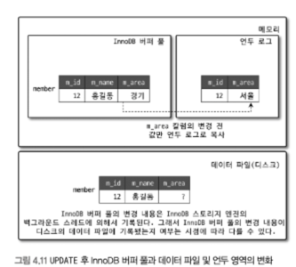

# 아키텍처 
MySQL 서버는 사람의 머리 역할을 담당하는 MySQL 엔진과 손발 역할을 담당하는 스토리 엔진으로 구분된다. 손가 발의 역할을 담당하는 스토리지 엔진은 핸들러 API를 만족하면 누구든지 스토리지 엔진을 
구현해서 MySQL 서버에 추가해서 사용할 수 있다.


## MySQL 엔진 아키텍처 


### MySQL 엔진 
MySQL 엔진은 클라이언트로부터의 접속 및 쿼리 요청을 처리하는 커넥션 핸들러와 SQL 파서 및 전처리기, 쿼리의 최적화된 실행을 위한 옵티마이저가 중심을 이룬다.


### 스토리지 엔진
MySQL 엔진은 요청된 SQL 문장을 분석하거나 최적화하는 등 DBMS의 두뇌에 해당하는 처리를 수행하고, 실제 데이터를 디스크 스토리지에 저장하거나 디스크 스토리지로부터 데이터를 읽어오는 부분은 스토리지 
엔진이 전담한다.

- MySQL 서버에서 MySQL 엔진은 하나지만 스토리지 엔진은 여러개를 동시에 사용할 수 있다. 테이블이 사용할 스토리지 엔진을 지정하면 해당 테이블의 `모든 읽기 작업이나 변경 작업`은 정의된 스토리지 
  엔진이 처리된다. 
  - `CREATE TABLE test_table (fd1 ,, ,,) ENGINE=InnoDB`
- 정의된 스토리지 엔진은 성능 향상을 위해 키 캐시(MyISAM 스토리지 엔진)나 InnoDB 버퍼 풀(InnoDB 스토리지 엔진)과 같은 기능을 내장하고 있다.

### 핸들러 API 
- MySQL 엔진의 쿼리 실행기에서 데이터를 쓰거나 읽어야 할 때는 각 스토리지 엔진에 쓰기 또는 읽기를 요청하는데 이러한 요청을 핸들러 요청이라 한다.
- 여기서 사용되는 API를 핸들러 API라고 하고 InnoDB 스토리지 엔진 또한 이 핸들러 API를 이용해 MySQL 엔진과 데이터를 주고받는다. 
- 핸들러 API를 통해 얼마나 많은 데이털 작업이 있었는지 확인 하는 쿼리 
  - `SHOW GLOBAL STATUS LIKE Handler%`


## MySQL 스레딩 구조 

MySQl 서버는 **`프로세스 기반이 아닌 스레드 기반`**으로 작동 되며, 크게 포그라운드 스레드와 백그라운드 스레드로 구분된다. 

- 서버에서 실행 중인 스레드의 목록은 다음 쿼리를 통해 알 수 있다. 
  - `SELECT thread_id, name, type, processlist_user, processlist_hos FROM performance_schema, threads ORDER BY type ,
    thread_id;`


- 위 사진에서 `thread/sql/one_connection` 스레드만 실제 사용자의 요청을 처리하는 포그라운드 스레드다. 
- 백그라운드 스레드의 개수는 MySQL 서버의 설정 내용에 다라 가변적일 수 있다. 동일한 이름의 스레드가 2개 이상씩 보이는 것은 MySQL 서버의 설정 내용에 의해 스레드가 동일 작업을 병렬로 처리하는 경우다.

### 포그라운드 스레드(클라이언트 스레드)
- 포그라운드 스레드는 최소한 MYSQL 서버에 접속된 클라이언트의 수만큼 존재하고, 사용자가 요청하는 쿼리 문장을 처리한다.
- 사용자가 작업을 마치고 해당 커넥션을 종료하면 해당 커넥션을 담당하던 스레드는 다시 스레드 캐시로 되돌아간다.
- 이미 스레드 캐시에 일정 개수 이상의 대기 중인 스레드가 있으면 스레드 캐시에 넣지 않고 스레드를 종료 시켜 일정 개수의 스레드만 스레드 캐시에 존재하게 한다.
  - 스레드 캐시에 유지할 수 있는 최대 스레드 개수는 **thread_cache_size** 시스템 변수로 설정한다.
- 포그라운드 스레드는 데이터를 MySQL 의 데이터 버퍼나 캐시로부터 가져온다. 
- 버퍼나 캐시에 없는 경우엔 직접 디스크의 데이터나 인덱스 파일로부터 데일터를 읽어와서 작업을 처리한다. 
- MyISAM 테이블은 디스크 쓰기 작업까지 포그라운드 스레드가 처리하지만 InnoDB 테이블은 데이터 버퍼나 캐시까지만 포그라운드 스레드가 처리하고 나머지 버퍼로부터 디스크까지 기록하는 작업은 백그라운드 
  스레드가 처리한다.

### 백그라운드 스레드 
- 인서트 버퍼를 병합하는 스레드
- 로그를 디스크로 기록하는 스레드
- InnoDB 버퍼 풀의 데이터를 디스크에 기록하는 스레드
- 데이터를 버퍼로 읽어 오는 스레드
- 잠금이나 데드락을 모니터링하는 스레드 
- 대부분 쓰기 작업은 버퍼링해서 일괄 처리하는 기능이 탑재돼 있어, 사용자 스레드가 쓰기 작업까지 함께 처리하도록 설계돼 있다. 그러므로 INSERT,UPDATE,DELETE 쿼리로 데이터가 변경되는 경우 
  데이터가 디스크의 데이터 파일로 완전히 저장 될 때까지 기다리지 않아도 된다.

### 메모리 할당 및 사용 구조 

MySQL에서 사용되는 메모리 공간은 **글로벌 메모리 영역과 로컬 메모리 영역**으로 구분된다.
### 글로벌 메모리 영역
- 공간만큼 예약해두고 필요할 때 조금식 할당해 준다.
- 클라이언트 스레드의 수와 무관하게 하나의 메모리 공간만 할당된다. 
- 2개 이상의 메모리 공간을 할당받을 수도 있지만 클라이언트의 스레드 수와는 무관하며, 생성된 글로벌 영역이 N개라 하더라도 모든 스레드에 의해 공유된다. 
- 테이블 캐시
- InnoDB 버퍼 풀
- InnoDB 어댑티브 해시 인덱스
- InnoDB 리두 로그 버퍼

### 로컬 메모리 영역
세션 메모리 영역이라고 표현되며, MySQL 서버상에 존재하는 클라이언트 스레드가 쿼리를 처리하는 데 사용하는 메모리 영역이다. 
- 클라이언트가 mysql 서버에 접속하면 mysql 서버에서는 클라이언트 커넥션으로부터의 요청을 처리하기 위해 스레드를 하나씩 할당하게 되는데, 클라이언트 스레드가 사용하는 메모리 공간이라고 해서 클라이언트 
  메모리 영역이라고 한다. 
- 클라이언트와 mysql 서벙와의 커넥션을 세션이라고 하기 때문에 로컬 메모리 영역을 세션 메모리 영역이라고도 표현함 
- 로컬 메모리는 각 클라이언트 스레드별로 독립적으로 할당되고 절대 공유되어 사용되지 않는다는 특징이 있다. 
- mysql 서버가 메모리 부족으로 멈춰 버릴 수 있으니 적절한 메모리 공간을 설정하는 것이 좋다 
- 쿼리의 용도별로 필요할 때만 공간이 할당되고 필요하지 않은 경우에는 MySQL이 메모리 공간을 할당조차도 하지 않을 수도 있다 (소트 버퍼, 조인 버퍼 공간)
- 로컬 메모리 공간은 커넥션이 열려 있는 동안 계속 할당된 상태로 남아 있는 공간도 있고 (커넥션 버퍼나 결과 버퍼) 그렇지 않고 쿼리를 실행하는 순간에만 할당했다가 다시 해제하는 공간(소트 버퍼나 조인 
  버퍼)도 있다. 
- 로컬 메모리 영역 
  1. 정렬 버퍼 
  2. 조인 버퍼 
  3. 바이너리 로그 캐시
  4. 네트워크 버퍼 

## 플러그인 스토리지 엔진 모델 


전문 엔진 검색을 위해 검색어 파서(인덱싱할 키워드를 분리해내는 작업) 도 플러그인 형태로 개발해서 사용할 수 있으며, 사용자의 인증을 위한 Native Authentication 과 Caching SHA-2 
Authentication 등도 모두 플러그인으로 구현되어 제공 된다 .


### MySQL에서 쿼리가 실행되는 과정 

- 대부분 작업이 MySQL 엔진에서 처리되고 마지막 '데이터 읽기/쓰기' 작업만 스토리지 엔진에 의해 처리된다(만약 사용자가 새로운 용도의 스토리지 엔진을 만든다 하더라도 DBMS의 전체 기능이 아닌 
  일부분의 기능만 수행하는 엔진을 작성하게 된다는 의미다)
- mysql 엔진이 각 스토리지 엔진에게 데이터를 읽어오거나 저장하도록 명령하려면 반드시 핸들러를 통해야 한다.
- 하나의 쿼리 작업은 여러 하위 작업으로 나뉘는데 각 하위 작업이 MySQL 엔진 영역에서 처리되는지 아니면 스토리지 엔진 영역에서 처리되는지 구분할 줄 알아야한다

#### MySQL 서버 에서 지원되는 스토리지 엔진


- YES: mysqld 에 해당 스토리지 엔진이 포함돼 있고, 사용 기능으로 활성화된 상태 
- DEFAULT: 'YES' 와 동일한 상태이지만 필수 스토리지 엔진임을 의미 (해당 스토리지 엔진이 없으면 MySQL이 시작되지 않을 수도 있음을 의미)
- NO: 현재 MySQL 서버에 포함되지 않았음을 의미 
- DISABLED: 현재 MySQL 서버에는 포함됐지만 파라미터에 의해 비활성화 된 상태 

서버에 포함되지 않은 스토리지 엔진을 사용하려면 서버를 다시 빌드해야 한다. 하지만 서버가 적절히 준비만 돼 있으면 플러그인 형태의 스토리지 엔진은 손쉽게 업그레이드 할 수 있다.

- 스토리지 엔진 인증 및 전문 검색용 파서 플러그인 검색 
  - `SHOW PLUGINS;`

### 컴포넌트 
> 8.0 부터는 기존의 플러그인 아키텍처를 대체하기 위해 컴포넌트 아키텍처가 지원된다. mysql 서버의 플러그인은 몇 가지 단점들을 보완하기 위해 구현됐다 

- 플러그인은 오직 MySQL 서버와 인터페이스할 수 있고, 플러그인끼리는 통신할 수 없다
- 플러그인은 MySQL 서버의 변수나 함수를 직접 호출하기 때문에 안전하지 않음 
- 플러그인은 상호 의존 관계를 설정할 수 없어서 초기화가 어려움 

## 쿼리 실행 구조

### 쿼리 파서 
- 사용자 요청으로 들어온 쿼리 문장을 토큰(mysql이 인식할 수 있는 최소 단위의 어휘나 기호)으로 분리해 트리 형태의 구조로 만들어 내는 작업을 의미한다.

### 전처리기 
- 파서 과정에서 만들어진 파서 트리를 기반으로 쿼리 문장에 구조적인 문제점이 있는지 확인한다. 
- 각 토큰을 테이블 이름이나 칼럼 이름, 또는 내장 함수와 같은 개체를 매핑해 해당 객체의 존재 여부와 객체의 접근 권한 등을 확인하는 과정을 이 단계에서 수행 
- 실제 존재하지 않거나 권한상 사용할 수 없는 개체의 토큰은 이 단계에서 걸러진다.

### 옵티마이저 
> 사용자의 요청으로 들어온 쿼리 문장을 저렴한 비용으로 가장 빠르게 처리할지를 결정하는 역할을 담당하며, DBMS의 두뇌에 해당된다.
> 

### 실행 엔진 
> 옵티마이저가 두뇌라면 실행 엔진과 핸들러는 손과 발에 비유할 수 있다. (예를 들어 GROUP BY를 처리하기 위해 임시테이블을 사용하기로 결정했을때 아래와 같다).
- 실행 엔진이 핸들러에게 임시 테이블을 만들라고 요청 
- 다시 실행 엔진은 WHERE 절에 일치하는 레코드를 읽어오라고 핸들러에게 요청 
- 읽어온 레코드들을 1번에서 준비한 임시 테이블로 저장하라고 다시 핸들러에게 요청 
- 데이터가 준비된 임시 테이블에서 필요한 방식으로 데이터를 읽어 오라고 핸들러에게 다시 요청 
- 최종적으로 실행 엔진은 결과를 사용자나 다른 모듈로 넘김 

실행 엔진은 만들어진 계획대로 각 핸들러에게 요청해서 받은 결과를 또 다른 핸들러 요청의 입력으로 연결하는 역할을 수행 

### 핸들러(스토리지 엔진)
- mysql 서버의 가장 밑단에서 mysql 실행 엔진의 요청에 따라 데이터를 디스크로 저장하고 디스크로부터 읽어 오는 역할을 담당 
- 핸들러는 스토리지 엔진을 의미하고, MyISAM 테이블을 조작하는 경우엔 MyISAM 스토리지 엔진이 되고, InnoDB테이블을 조작할 땐 InnoDB 스토리지 엔진이 된다 

## 복제 
- mysql 서버에서 복제(Replication)는 매우 중요한 역할을 담당하며 mysql 서버에서 복제는 많은 발전을 거듭해왔다
### 쿼리 캐시 
> 쿼리 캐시는 빠른 응답을 필요로 하는 웹 기반의 응용 프로그램에서 매우 중요한 역할을 담당했다 
- 쿼리 캐시는 SQL의 실행 결과를 메모리에 캐시한다 동일 SQL 쿼리가 실행되면 테이블을 읽지 않고 즉시 결과를 반환하기 때문에 매우 빠른 성능을 보였지만 쿼리 캐시는 테이블의 데이터가 변경되면 캐시에 
  저장된 결과 중에서 변경된 테이블과 관련된 것들은 모두 삭제해야 했다. -> 이는 동시 처리 성능 저하를 유발함 
- 8.0 부터는 쿼리 캐시가 서버의 기능에서 완전히 제거되고, 관련된 시스템 변수도 모두 제거 됐음.
- MySQL 서버의 쿼리 캐시 기능은 아주 독특한 환경에서는 매우 훌륭한 기능이지만 이런 요건을 가진 서비스는 흔치 않다. -> 이러한 이유로 쿼리 캐시를 제거하는 것은 좋은 선택이고 실제로 큰 도움은 
  되지 않았지만 수많은 버그의 원인으로 지목되는 경우가 많았다.

### 스레드 풀 
> 스레드 풀은 엔터프라이즈 에디션에서는 제공하지만 커뮤니티 에디션은 스레드 풀 기능을 지원하지 않는다 . 여기서 말하는 스레드 풀은 엔터프라이즈 에디션에 포함된 스레드 풀 대신 Percona Server 에서 제공하는 스레드 풀 기능을 알려준다
> 
- 스레드 풀은 내부적으로 사용자의 요청을 처리하는 스레드 개수를 줄여서 동시 처리되는 요청이 많다 하더라도 MySQL 서버의 CPU 가 제한된 개수의 스레드 처리에만 집중할 수 있게 해서 서버의 자원 소모를 줄이는 것이 목적이다.
- MySQL 서버에서 스레드 풀만 설치하면 성능이 그냥 두 배 올라갈 거라고 생각하는데 향상을 보여준 경우는 드물다. 
- 스레드 풀은 스케줄링 과정에서 CPU 시간을 제대로 확보하지 못하는 경우에는 쿼리 처리가 더 느려지는 사례도 있다. 
  - 제한된 수의 스레드만으로 CPU가 처리하도록 적절히 유도하면 CPU의 프로세서 친화도도 높이고 운영체제 입장에서는 불필요한 컨텍스트 스위치를 줄여서 오버헤드를 낮출 수 있다. 

### Percona Server 스레드 풀 
- 기본적으로 CPU 코어의 개수만큼 스레드 그룹을 생성하는데 스레드 그룹의 개수는 `thread_pool_size` 시스템 변수를 변경해서 조정할 수 있다.
- 일반적으로 CPU 코어의 개수와 맞추는 것이 CPU 프로세서 친화도를 높이는데 좋다. 
- mysql 서버가 처리해야 할 요청이 생기면 스레드 풀로 처리를 이관하는데, 이미 처리 중인 작업이 있는 경우에는 `thread_pool_oversubscribe` 시스템 변수에 설정된 개수만큼 추가로 더 
  받아들여서 처리한다 -> 값이 너무 크면 스케줄링해야 할 스레드가 많아져서 스레드 풀이 비효율적으로 작동할 수도 있다. 
- 스레드 그룹의 모든 스레드가 일을 처리하고 있으면 새로운 작업 스레드를 추가할지 완료할 때까지 기다릴지 여부를 판단해야한다. 
  - 주기적으로 `thread_poolstall_limit` 시스템 변수를 통해 추가하자.
  - 이때 스레드 풀에 있는 스레드의 개수는 `thread_pool_max_threads` 시스템 변수에 설정된 개수를 넘어설 수 없다.
- 스레드풀은 `thread_pool_stall_limit` 시간 동안 기다려야 새로 들어온 요청을 처리할 수 있다. 
  - 값을 0 으로 설정해야 한다면 스레드 풀을 사용하지 않는 편이 낫다. 
- Percona Server의 스레드 풀 플러그인은 선순위 큐와 후순위 큐를 이용해 특정 트랜잭션이나 쿼리를 우선적으로 처리할 수 있는 기능도 제공한다.
  - 트랜잭션 잠금이 빨리 해제되고 잠금 경합을 낮춰 전체적인 성능이 향상됌 

## 트랜잭션 지원 메타데이터 
>5.7 버전까지 테이블의 구조를 FRM 파일에 저장하고 일부 스토어드 프로그램 또한 파일(*.TRN, *.TRG, *.PAR) 기반으로 관리했는데 이러한 파일 기반 메타데이터가 트랜잭션을 지원하지 않기 때문에 비정상적으로 종료 될 때 일관되지 않은 상태로 남는다. 많은 사용자들이 이 같은 현상을 가리켜 '데이터베이스나 테이블이 깨졌다'라고 표현함 
> 
- 8.0 InnoDB 부터는 메타데이터 정보를 테이블에 저장하도록 개선됐다. 
- 8.0 부터는 사용자 인증과 권한에 대한 필요데이터를 시스템 테이블에 저장했고 데이터 딕셔너리 정보를 모두 모아서 mysql DB에 저장하였다. 
- mysql DB는 통째로 mysql.ibd 라는 이름의 테이블스페이스에 저장된다.-> *.ibd 파일은 주의해야한다 

## InnoDB 스토리지 엔진 아키텍처 
> InnoDB 스토리지 엔진은 스토리지 엔진 중 거의 유일하게 레코드 기반의 잠금을 제공하고 이 때문에 높은 동시성 처리가 가능하고 안정적이며 성능이 뛰어나다. 


### 프라이머리 키에 의한 클러스터링 
- InnoDB의 모든 테이블은 기본적으로 프라이머리 키를 기준으로 클러스터링되어 저장된다. (키 값의 순서대로 디스크에 저장된다)
- 모든 세컨더리 인덱스는 레코드의 주소 대신 프라이머리 키의 값을 논리적인 주소로 사용한다. 프라이머리 키가 클러스터링 인덱스이기 때문에 프라이머리 키를 이용한 레인지 스캔은 상당히 빨리 처리될 수 있다. 
- 쿼리의 실행 계획에서 프라이머리 키는 기본적으로 다른 보조 인덱스에 비해 비중이 높게 설정(쿼리의 실행 계획에서 다른 보조 인덱스보다 프라이머리 키가 선택될 확률이 높음) 된다.


### 외래 키 지원 
> 외래 키에 대한 지원은 InnoDB 스토리지 엔진 레벨에서 지원하는 기능으로 MyISAM 이나 MEMORY 테이블에서는 사용할 수 없다. 
> 
- InnoDB 에서 외래 키는 부모 테이블과 자식 테이블 모두 해당 칼럼에 인덱스 생성이 필요하고 변경 시에는 반드시 부모 테이블이나 자식 테이블에 데이터가 있는지 체크하는 작업이 필요하므로 잠금이 여러 
  테이블로 전파되고, 그로 인해 데드락이 발생할 때가 많아 개발할 때도 외래 키의 존재에 주의하는 것이 좋다
- 수동으로 데이터를 적재하고 스키마 변경시 작업이 실패할 수 있다. 
  - 서비스가 문제가 있어서 긴급하게 조치를 취해야한다면 `foreign_key_checks` 시스템 변수를 OFF 로 설정하면 외래 키 관계에 대한  체크 작업을 일시적으로 멈출수 있다. 
```shell
SET foreign_key_checks=OFF;

SET foreign_key_checks=ON;
```
- 외래 키를 일시적으로 해제했다고 해서 부모와 자식 테이블 간의 관계가 깨진 상태로 그대로 유지해도 된다는 것을 의미하지는 않는다.
  - 중지한 상태에서 외래 키관계를 가진 부모 테이블의 레코드를 삭제했다면 반드시 자식 테이블의 레코드도 삭제해서 일관성을 맞춰준 후 다시 외래 키 체크 기능을 활성화해야 한다. 
  - `foregin_key_checks` 가 빌활성화 되면 외래 키 관계의 부모 테이블에 대한 작업 ON UPDATE CASCADE 옵션 도 무시하게 된다. 


### MVCC (Multi Version Concurrency Control)
> MVCC의 가장 큰 목적은 잠금을 사용하지 않는 일관된 읽기를 제공하는 데 있다. 
- InnoDB는 언두 로그를 이용해 이 기능을 구현한다. 
- 멀티 버전은 하나의 레코드에 대해 여러 개의 버전이 동시에 관리된다는 의미다. 

#### 격리 수준 (Isolation Level) 이 READ_COMMITED 인 MySQL 서버에서 InnoDB 스토리지 엔진을 사용하는 테이블의 데이터 변경을 어떻게 처리 될까 ?
- 한 건의 레코드를 INSERT 한 다음 UPDATE 해서 발생하는 변경 작업 및 절차 
 - INSERT 문이 실행 될 때 
 - 
 - 이후 UPDATE 문이 실행 될 때 
 - 
   - UPDATE 문이 실행되면 커밋 실행 여부와 관계없이 새로운 값으로 업데이트 된다 
   - 디스크의 데이터 파일에는 체크포인트나 InnoDB의 Write 스레드에 의해 새로운 값으로 업데이트돼 있을 수도 있고 아닐 수도 있다 (ACID 를 보장하기 때문에 버퍼 풀과 데이터 파일은 동일한 
     상태라고 가정해도 무방 )
   - **아직 커밋이나 롤백이 되지 않은 상태에서 다른 사용자가 다음 같은 쿼리로 작업 중인 레코드를 조회하면 어디에 있는 데이터를 조회할까 ?** 
     1. 시스템 변수에 설정된 격리 수준에 따라 다르다 . 
     2. `READ_UNCOMMITTED`인 경우에는 INNODB 버퍼 풀이 현재 가지고 있는 변경된 데이터를 읽어서 반환한다.
        1. 데이터가 커밋됐든 아니든 변경된 상태의 데이터를 반환한다.
     3. `READ_COMMITED` 그 이상의 격리 수준인 경우에는 아직 커밋되지 않았기 때문에 InnoDB 버퍼 풀이나 데이터 파일에 있는 내용 대신 변경되기 이전의 내용을 보관하고 있는 언두 영역의 
        데이터를 반환한다. -> 이러한 일련의 과정을 DBMS에서는 MVCC라고 부른다.
- 트랜잭션이 길어지면 언두에서 관리하는 예전 데이터가 삭제되지 못하고 오랫동안 관리돼야 하며 자연히 언두 영역이 저장되는 시스템 테이블스페이스의 공간이 많이 늘어나는 상황이 발생할 수도 있다.
하나의 레코드에 대해 2개의 버전이 유지되고 필요에 따라 어느 데이터가 보여지는지 여러 가지 상황에 따라 달라지는 구조다. 

_UPDATE 쿼리가 실행되면 InnoDB 버퍼 풀은 즉시 새로운 데이터로 변경되고 기존 데이터는 언두 영역으로 복사되는 과정이다. COMMIT 명령을 실행하면 InnoDB는 더 이상의 변경 작업 없이 지금의 상태를 영구적인 데이터로 만들어 버린다._

_하지만 롤백을 실행하면 언두 영역에 있는 백업된 데이터를 버퍼 풀로 다시 복구하고 언두 영역의 내용을 삭제해버린다. 언두 영역은 필요로 하는 트랜잭션이 더는 없을 때 비로소 삭제된다 ._


### 잠금 없는 일관된 읽기 (Non-Locking Consistent Read)
>MVCC 기술을 이용해 잠금을 걸지 않고 읽기 작업을 수행할 수 있기 때문에 다른 트랜잭션이 가지고 있는 잠금을 기다리지 않고, 읽기 작업이 가능하다.
- 격리 수준이 `SERIALIZABLE` 이 아닌 `READ_UNCOMMITED` 나 `READ_COMMITED`,`REPEATABLE_READ` 수준일때 `INSERT` 와 연결되지 않은 순수한 읽기 작업은 
  다른 트랜잭션의 변경 작업과 관계없이 항상 잠금을 대기하지 않고 바로 실행한다.
- 특정 사용자가 레코드를 변경하고 커밋을 수행하지 않아도 변경 트랜잭션이 다른 사용자의 `SELECT` 작업을 방해하지 않는다.
- 오랜 시간 동안 활성 상태인 트랜잭션으로 인해 MySQL 서버가 느려지거나 문제가 발생할때 바로 이러한 일관된 읽기를 위해 언두 로그를 삭제하지 못하고 계속 유지해야 하기 때문에 발생하는 문제다. -> 
  문제를 해결할려면 트랜잭션이 시작됐다면 가능한 한 빨리 롤백이나 커밋을 통해 트랜잭션을 완료하는 것이 좋다 

### 자동 데드락 감지 
- InnoDB 스토리지 엔진은 데드락 감지 스레드를 가지고 있어서 데드락 감지 스레드가 주기적으로 잠금 대기 그래프를 검사해 교착 상태에 빠진 트랜잭션들을 찾아서 그중 하나를 강제 종료한다 .
- 어느 트랜잭션을 종료할 것인지를 판단하는 기준은 트랜잭션의 언두 로그 양이며, 언두 로그 레코드를 더 적게 가진 트랜잭션이 일반적으로 롤백의 대상이 된다. 
  - 언두 로그 레코드가 적게 가졌다는건 롤백을 해도 언두 처리를 해야할 내용이 적다라는 얘기며 트랜잭션 강제 롤백으로 MySQL 서버의 부하도 덜 유발한다. 
- InnoDB 스토리지 엔진에서 관리되는 테이블 잠금은 볼 수가 없어, 데드락 감지가 불확실하는데 `innodb_table_locks` 시스템 변수를 활성화하면 InnoDB 스토리지 엔진 내부의 레코드 잠금 
  뿐 아니라 테이블 레벨의 잠금 까지 감지 할 수 있다. 
  - 특별한 이유가 없으면 시스템 변수를 활성화 하는것이 좋다
  - 동시 처리 스레드가 매우 많아지면 각 트랜잭션이 가진 잠금의 개수가 많아져 데드락 감지 스레드가 느려진다. 
- 데드락 감지 스레드는 잠금 목록을 검사해야 하기 때문에 잠금 상태가 변경되지 않도록 잠금 목록이 저장된 리스트(잠금 테이블)에 새로운 잠금을 걸고 데드락 스레드를 찾게 된다.
  - 데드락 감지 스레드가 느려지면 처리 중인 스레드가 작업을 진행하지 못하고 서비스에 악영향을 미치며 더 많은 CPU 자원을 소모할 수도 있다.
  - MySQL 서버는 `innodb_deadlock_detect` 시스템 변수를 제공하며 데드락 감지 스레드를 ON,OFF 기능을 통해 사용할 수 있다.
  - 2개 이상의 트랜잭션이 상대방이 가진 잠금을 요구하는 상황이 발생해도 누군가 중재를 하지 않기 때문에 무한정 대기하게 된다.
  - `innodb_lock_wait_timeout` 변수를 활성화하면 데드락 상황에서 일정 시간이 지나면 자동으로 요청이 실패하고 에러 메시지를 반환한다. 
    1. 초 단위로 설정이 가능하며 잠금을 설정한 시간 동안 흭득하지 못하면 쿼리는 실패하고 에러를 반환하고 데드락 감지 스레드가 부담되면 `innodb_deadlock_detect`를 OFF로 설정하여 
       기본 값을 50초보다 훨 씬 낮은 시간으로 변경해서 사용하는 걸 권장한다.
- 구글에서는 프라이머리 키 기반의 조회로 실행되는 서비스가 많았는데 매우 많은 트랜잭션을 동시에 실행하기 때문에 데드락 감지 스레드가 상당히 성능을 저하시키는 것을 알아냈으며 MYSQL 서버의 소스코드를 
  변경해서 데드락 감지 스레드를 활성화 또는 비활성화 할 수 있게 변경하였다. 만약 FK 또는 세컨더리 인덱스를 기반으로 매우 높은 동시성 처리를 요구하는 서비스가 있다면 
  `innodb_deadlock_detect`를 비활성화해서 성능 비교를 해보는 것도 새로운 기회가 될 것이다.


### 자동화된 장애 복구 
> InnoDB에는 손실이나 장애로부터 데이터를 보호하기 위한 여러 가지 매커니즘이 탑재돼 있다. MySQL 서버가 시작될 때 완료되지 못한 트랜잭션이나 디스크에 일부만 기록된 데이터 페이지 등에 대한 일련의 복구 작업이 자동으로 진행된다.
- innoDB 스토리지 엔진은 매우 견고해서 데이터 파일이 손상되거나 서버가 시작되지 못하는 경우는 거의 발생하지 않지만, 서버와 무관하게 디스크나 서버 하드웨어 이슈로 InnoDB 스토리지 엔진이 자동으로 
  복구를 못하는 경우도 발생할 수 있으며, 일단 한 번 문제가 생기면 복구하기가 쉽지 않다. 이때는 `innodb_force_recovery` 시스템 변수를 설정해서 서버를 시작하면 된다 . 그러면 파일 
  손상 여부를 알 수 있다 . 
#### 파일의 손상 여부 검사 과정을 선별적으로 진행하는 과정 - innodb_force_recovery
- innoDB의 로그 파일이 손상됐다면 6으로 설정하고 MySQL 서버를 기동한다
- InnoDB 테이블의 데이터 파일이 손상됐다면 1로 설정하고 MySQL 서버를 기동한다 
- 어떤 문제이지 알 수 없으면 설정 값을 1 ~ 6 까지 일일이 변경하면서 재시작을 해보고 값이 커지면 그만큼 심각한 상황인 것을 인지해야하고 데이터 손실 가능성이 크고 복구 가능성은 적어진다. 

#### innodb_force_recovery 의 1부터 6까지 숫자 값으로 복구되는 장애 상황과 해결 방법 
> 서버가 기동되고 테이블이 인식되면 mysqldump를 이용해 데이터를 가능한 만큼 백업하고 그 데이터를 MySQL 서버의 DB와 테이블을 다시 생성하는 것이 좋다. 
>
- 1(SRV_FORCE_IGNORE_CORRUPT) : 데이블스페이스의 데이터나 인덱스 페이지에서 손상된 부분이 발견돼도 무시하고 서버를 시작한다. 에러 로그 `Database page corrution 
  on disk or a failed` 가 출력되면 mysqldump 프로그램이나 SELECT INTO OUTFILE ... 명령을 이용해 덤프해서 데이터베이스를 다시 구축 해라 
- 2(SRV_FORCE_NO_BACKGROUND): InnoDB 쿼리의 처리를 위해 여러 종류의 백그라운드 스레드를 동시에 사용한다. 이 복구 모드에선 백그라운드 스레드 가운데 메인 스레드를 시작하지 않고 
  MySQL 서버를 시작한다. 트랜잭션의 롤백을 위해 언두 데이터를 관리하는데 트랜잭션이 커밋되어 불필요한 언두 데이터는 InnoDB의 메인 스레드에 의해 주기적으로 삭제된다. InnoDB의 메인 스레드가 
  언두 데이터를 삭제하는 과정에서 장애가 발생한다면 이 모드로 복구하면 된다 . 
- 3(SRV_FORCE_NO_TRX_UNDO): 롤백에 대비해 변경 전의 데이터를 언두 영역에 기록하고 서버를 다시 시작하면서 언두 영역의 데이터를 먼저 데이터 파일에 적용하고 그다음 리두로그의 내용을 다시 
  덮어써서 장애 시점의 데이터 상태를 만들어낸다. MySQL 서버의 시작에서는 최종적으로 커밋되지 않은 트랜잭션은 롤백을 수행하지만 3으로 설정되면 커밋되지 않은 트랜잭션의 작업을 롤백하지 않고 그대로 
  나둔다. 즉 커밋되지 않고 종료된 트랜잭션은 계속 그 상태로 남아 있게 MySQL 서버를 재시작하는 모드다. 이때도 우선 MySQL 서버가 시작되면 mysqldump를 이용해 데이터를 백업해서 다시 데이터베이스를 구축하는것이 좋다 
- 4(SERV_FORCE_NO_IBUF_MERGE): INSERT,UPDATE,DELETE 등의 데이터 변경으로 인한 인덱스 변경 작업을 상황에 따라 즉시 처리할 수도 있고 인서트 버퍼에 저장해서 나중에 
  처리할 수도 있다. 인서트 버퍼에 기록된 내용은 언제 데이터 파일에 병합 될지 알 수 없다. MySQl 을 종료해도 병합되지 않을 수 있는데 MySQL이 재시작되면서 인서트 버퍼의 손상을 감지하면 
  InnoDB는 에러를 발생시키고 서버는 시작하지 못한다. 이때 변수값을 4로 설정하면 인서트 버퍼의 내용을 무시하고 강제로 MySQl이 시작되게 하고 인서트 버퍼는 실제 데이터와 관련된 부분이 아니라 
  인덱스에 관련된 부분이므로 테이블을 덤프한 후 다시 데이터베이스를 구축하면 데이터의 손실 없이 복구할 수 있다. 
- 5(SRV_FORCE_NO_UNDO_LOG_SCAN): 서버가 장애나 정상적으로 종료되는 시점에 진행 중인 트랜잭션이 있었다면 MySQL은 그냥 단순히 그 커넥션을 강제로 끊어 버리고 별도의 정리 작업 
  없이 종료한다. MySQL이 다시 시작하면 InnoDB 엔진은 언두 레코드를 이용해 데이터 페이지를 복구하고 리두 로그를 적용해 종료 시점이나 장애 발생 시점의 상태를 재현해 낸다. 그리고 마지막으로 
  커밋되지 않은 트랜잭션에서 변경한 작업은 모두 롤백 처리한다. 언두 로그를 사용할 수 없으면 서버를 시작 할 수 없다. 이 때 5로 설정하면 언두 로그를 모두 무시하고 mysql을 시작할 수 있지만 이 모드로 
  복구되면 서버가 종료되던 시점에 커밋되지 않았던 작업도 모두 커밋된 것처럼 처리되므로 실제로는 잘못된 데이터가 데이터베이스에 남는 것이라고 볼 수 있다. 이때도 똑같이 데이터를 백업하고 데이터베이스를 새로 
  구축해야 한다.
- 6(SRV_FORCE_NO_LOG_REDO): 스토리지 엔진의 리두 로그가 손상되면 서버가 시작되지 못한다. 이 복구 모드로 시작하면 엔진은 리두 로그를 모두 무시한 채 서버가 시작된다. 또한 커밋됐다 
  하더라도 리두로그에만 기록되고 데이터 파일에 기록되지 않은 데이터는 모두 무시된다. 즉 마지막 체크포인트 시점의 데이터만 남게 되고, 이 때는 기존 innoDB의 리두 로그는 모두 삭제(또는 별도의 
  디렉터리에 백업)하고 MySQl 서버를 시작하는 것이 좋다. MySQL 서버가 시작하면서 리두 로그가 없으면 새로 생성하므로 별도로 파일을 만들 필요는 없다. 이때도 mysqldump를 이용해 데이터를 
  모두 백업해서 MYsql 서버를 새로 구축하는 것이 좋다 

_마지막 풀 백업 시점부터 장애 시점까지의 바이너리 로그가 있다면 InnoDB의 복구를 이용하는 것보다 풀 백업과 바이너리 로그로 복구하는 편이 데이터 손실이 더 적을 수 있다. 백업은 있지만 복제의 바이너리 
로그가 없거나 손실됐다면 마지막 백업 시점까지만 복구할 수 있다_


### InnoDB 버퍼 풀 
> 스토리지 엔진에서 가장 핵심적인 부분이고, 디스크의 데이터 파일이나 인덱스 정보를 메모리에 캐시해 두는 공간이다. 
- 쓰기 작업을 지연시켜 일괄 작업으로 처리할 수 있게 해주는 버퍼 역할도 같이 한다. 
- 어플리케이션에서 데이터를 변경하는 쿼리는 데이터 파일의 이곳저곳에 위치한 레코드를 변경하기 때문에 랜덤한 디스크 작업을 발생시키고 버퍼 풀이 이러한 변경된 데이터를 모아서 처리하면 랜덤한 디스크 작업의 
  횟수를 줄일 수 있다. 


#### 버퍼 풀의 크기 설정 
> 전체 물리 메모리의 80% 정도를 InnoDB의 버퍼 풀로 설정하라는 내용의 게시물도 있는데, 그렇게 단순하게 설정해서 되는 값은 아니며 운영체제와 각 클라이언트 스레드가 사용할 메모리도 충분히 고려해서 
> 설정해야 한다. 
> 
- MySQL 서버 내에서 메모리를 필요로 하는 부분은 크게 없지만 아주 독특한 경우 레코드 버퍼가 상당한 메모리에 사용된다.
- MySQL 서버가 사용하는 레코드 버퍼 공간은 별도로 설정할 수 없고 전체 커넥션 개수와 각 커넥션에서 읽고 쓰는 테이블의 개수에 따라서 결정된다.
- InnoDB의 버퍼 풀 크기는 적절히 작은 값으로 설정해서 상황을 봐가면서 증가시키는게 최적의 방법이다.
  1. 처음으로 서버를 준비할땐 운영체제의 전체 메모리 공간이 8GB 미만이라면 50%정도만 InnoDB 버퍼 풀로 설정하고 나머지 메모리 공간은 MySQL 서버와 운영체제 그리고 다른 프로그램이 사용할 수 
     있는 공간으로 확보하는 것이 좋다 
  2. 전체 메모리 공간이 그 이상이라면 InnoDB 버퍼 풀의 크기를 전체 메모리의 50%에서 시작해서 조금씩 올라가면서 최적점을 찾는다. 
  3. 운영체제의 전체 메모리 공간이 50GB이상이면 대략 15GB 에서 30 GB정도를 운영체제와 다른 응용 프로그램을 위해서 남겨두고 나머지를 InnoDB 버퍼 풀로 할당하자 
- 버퍼 풀은 `innoddb_buffer_pool_size` 시스템 변수로 크기를 설정할 수 있고 동적으로 버퍼 풀의 크기를 확장할 수 있다.
  1. 버퍼 풀은 크리티컬한 변경이여서 서버가 한가한 시점에 진행하는 것이 좋다.
  2. 버퍼 풀의 크기를 줄이는 작업은 서비스 영향도가 매우 크므로 가능하면 버퍼 풀의 크기를 줄이는 작업은 하지 않도록 주의하자.
  3. 만일 버퍼 풀의 크기를 동적으로 변경해야 한다면 반드시 먼저 MySQL 메뉴얼 의 내용을 숙지하고 진행하기를 권장한다 
- 버퍼 풀은 전통적으로 버퍼 풀 전체를 관리하는 잠근(세마포어)으로 인해 내부 잠금 경합을 많이 유발해왔는데 이런 경합을 줄이기 위해 버퍼 풀을 여러 개로 쪼개어 관리할 수 있게 개선됐다. -> 이렇게 
  되므로 개별 버퍼 풀 전체를 관리하는 잠금 자체도 경합이 분산되는 효과를 낼 수 있다. 
  1. `innodb_buffer_pool_instances`를 통해 버퍼 풀을 여러 개로 분리해서 관리할 수 있다. 
  2. 기본적으로 버퍼 풀 인스턴스의 개수는 8개로 초기화되지만 전체 버퍼 풀을 위한 메모리 크기가 1GB 미만이면 버퍼 풀 인스턴스는 1개만 생성된다. 
  3. 버퍼 풀로 할당할 수 있는 메모리 공간이 40GB 이하 수준이면 기본 값인 8을 유지하고 메모리가 크다면 버퍼 풀 인스턴스당 5GB 정도가 되게 인스턴스 개수를 설정하는 것이 좋다. 
  4. 버퍼 풀은 내부적으로 128MB 청크 단위로 쪼개어 관리되며 크기를 줄이거나 늘리기 위한 단위 크기로 사용된다.

#### 버퍼 풀의 구조 
